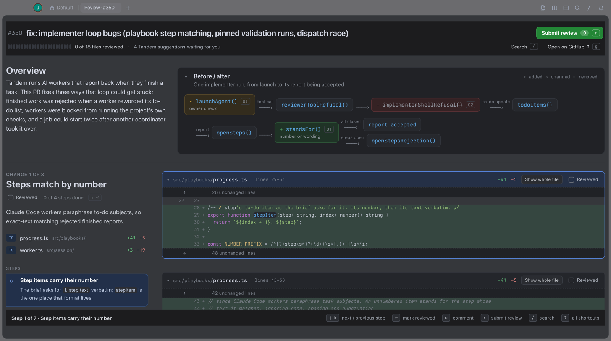
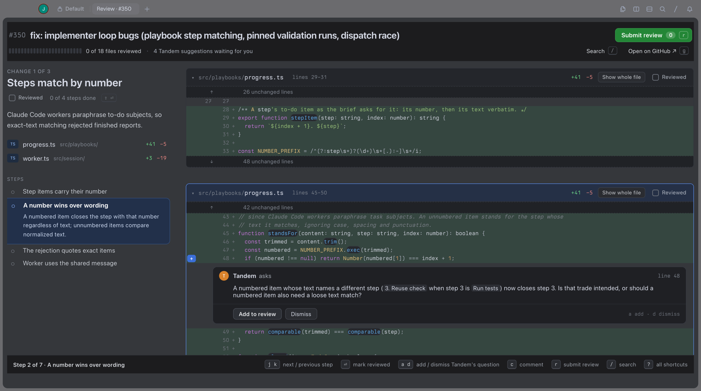
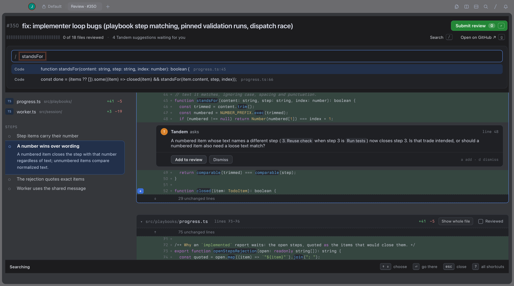
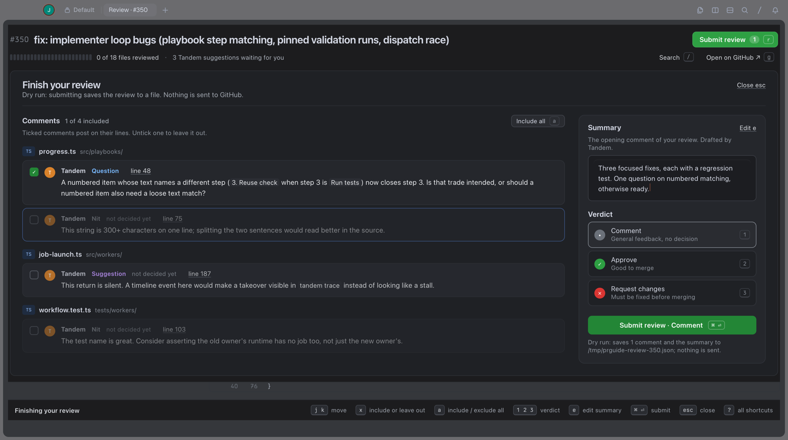
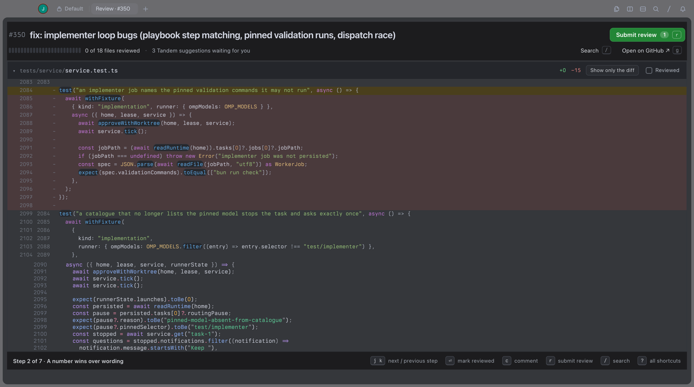

# PR Guide

**Review GitHub pull requests in Tern, one step at a time.**

PR Guide turns a pull request into a guided walkthrough. Instead of a wall of files, you read the
PR as a few changes, each broken into short steps with the code right beside a plain explanation.
Mark each step as you go, comment on any changed line, and post the whole review to GitHub in one
go, without leaving your terminal.



## What it does

**Starts with the big picture.** A short overview anyone can follow, and an optional before/after
diagram of what the PR changes.

**Walks you through the code.** Each change has a sticky card on the left with its steps; the code
for the step you're on sits on the right. `j`/`k` move between steps, `⏎` marks a step reviewed and
moves on.



**Suggested comments, if you want them.** A guide can come with suggested review comments. Add the
ones you agree with (`a`), dismiss the rest (`d`), or write your own: hover a changed line and click
`+`, or press `c` on a step.

**Finds anything.** `/` searches steps, files, comments and changed code, and jumps straight to the
line.



**Posts one review.** `r` opens your review: tick the comments to include, edit the summary, pick
Comment, Approve or Request changes, and submit with `⌘⏎`. Everything goes to GitHub as a single
review. If the PR got new commits while you were reading, nothing is posted and the page tells you.



**Handles big PRs and big files.** Changes are computed locally with git, so it isn't limited by
GitHub's diff size cap. Show a whole file and the changed parts stay marked while long untouched
stretches use Tern's own fast code viewer: a 5,600-line file opens instantly. The page also only
draws the code near where you are, so an 85-file PR stays responsive.



## Install

```sh
tern plugin install github.com/jdeocampo99/tern-pr-guide
```

You also need the [GitHub CLI](https://cli.github.com) logged in (`gh auth login`) and a local
clone of the repository whose PR you're reviewing, with `origin` pointing at it on GitHub.

To work on the plugin itself, clone it and use `tern plugin link /path/to/tern-pr-guide` instead.

## Review a PR

Open the review page from Lua, for example in Carly:

```lua
cx:new_block("prguide.guide", {"pr=123", "repo=/path/to/your/clone"}, "tab")
```

| Argument | Meaning |
|---|---|
| `pr=` | PR number or URL |
| `repo=` | path to your local clone |
| `guide=` | optional guide file (see below) |
| `post=true` | actually post to GitHub; without it, submitting saves the review to `/tmp/prguide-review-<n>.json` and sends nothing |

**PR Guide** in the command palette opens a built-in sample, so you can try it without a PR.

Behind the scenes it runs `gh pr view` once, fetches the PR into `refs/prguide/<n>/*` in your clone
(your branches and working tree are untouched), and diffs locally. Lockfiles and files marked
`linguist-generated` are left out. Remove the refs afterwards with
`git update-ref -d refs/prguide/<n>/head` (and `/base`).

## Guides

The page works on any PR as-is: one step per changed file. A **guide file** adds the walkthrough:
the overview, the diagram, the changes and their steps, suggested comments and a drafted summary.
Any tool can write one (an AI reviewer, a script, a person). The format is in [GUIDE.md](GUIDE.md).

## Keys

| Reading | | Reacting | | Finishing | |
|---|---|---|---|---|---|
| `j` `k` | next / previous step | `⏎` | step reviewed, move on | `r` | open your review |
| `n` `p` | next / previous suggestion | `⇧⏎` | whole change reviewed | `x` | include or leave out |
| `/` | search | `v` | whole file reviewed | `a` | include / exclude all |
| `s` | supporting changes | `a` `d` | add / dismiss suggestion | `1` `2` `3` | comment, approve, request changes |
| `o` | open every supporting file | `c` | comment on this step | `⌘⏎` | submit |
| `g` | open on GitHub | | | `?` | all shortcuts |

## Good to know

- GitHub only accepts review comments on lines the PR changed, so only those lines get a `+`, and a
  comment range stays within one block of changes.
- Tern has no way for a plugin to ask for input yet, which is why a PR is opened with a line of Lua.
- To keep every keypress fast, the page draws at most about 600 lines of code at once. Steps further
  away show just their file header and open when you reach them or click them.
